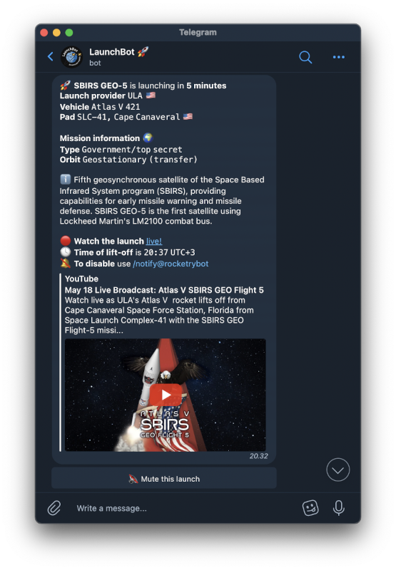

# LaunchBot – a rocket launch information and notifications bot for Telegram 🚀
LaunchBot keeps you up to date with what's going up, around the clock, since 2019. Over 800'000 notifications delivered to thousands of chats and groups!

Reachable as [@rocketrybot](https://t.me/rocketrybot) on Telegram.

## Features
LaunchBot uses the LaunchLibrary2 API to fetch launch information on scheduled intervals. The bot provides multiple forms of information: launch notifications, information about upcoming flights, and a simple flight schedule displaying upcoming flights at a glance.

Other features include...
- user-configurable notifications on a per-provider and per-country basis
- user-configurable notification times from 4 different options
- notifications of launches being postponed
- muteable launches
- direct links to launch webcasts
- automatically cleared notification messages
- simple information refresh with Telegram's message buttons
- spam management for groups (removes requests the bot won't respond to)

## Basic instructions
Clone the repository and install all dependencies with `go get all`. Then, `cd` into `/cmd` and build the program with `./build.sh`. This may require you to allow executing the script: this can be done with `chmod +x build.sh`. Once done, `cd` back into the main folder with `cd ..`.

Now, you can run the program: to start, open a new terminal window, and run `./launchbot`. The bot will ask you for a Telegram bot API key: you can get one from BotFather on Telegram.

If you would like to view the logs as they come in, instead of saving them to a dedicated log-file, add the `--debug` option.

## Data
SQLite: `data/launchbot.db`: houses all data the bot needs to operate, including launch information, statistics, chat preferences, etc.

json: `data/config.json`: used to configure the bot by setting the Telegram bot API key, alongside with some other configuration information.

You can specify your personal account's Telegram user ID in `config.json` in the form `owner: your_user_id`. This disables the logging of commands sent by you.

## Privacy

The bot stores every interaction (i.e. command) sent to it if logging is enabled, alongside with a truncated, unsalted SHA-1 hash of the user ID. No text messages are stored, aside from text sent as a reply to a feedback request message. The bot's privacy settings forbid the bot from reading regular text, as in text messages which have not tagged the bot (@botusername) or are not a reply to a message sent by the bot (these are not logged, unless they're a reply to a feedback message.)

Only information stored by the bot is the chat ID, which is used to deliver notifications, manage spam, and keep statistics. Users can optionally store their time zone as a time zone database entry (e.g. Europe/Berlin), which can be removed at any time.

The above only applies on a per-bot-instance basis. The creator of the bot chooses whether to configure the bot to be able to read all text messages, not just ones directed at the bot. Telegram bots are, by nature, extremely privacy invasive: don't add unknown bots to group chats, unless it's hosted by you or someone you trust.

## Roadmap and historical changelog

  
View changelog/roadmap

  	
	## 1.0 / first implementation (November 2019)

	- ✅ implemented uncached API requests
	
	- ✅ implemented the request of next launch via a direct API call

	
	## 1.2 / basic features (December 2019)

	- ✅ implement /next using DB calls
	
	- ✅ implement support for SpaceX core information

	
	## 1.3 / user-facing features (January 2020)
	
	- ✅ add "next" and "previous" button(s) to /next command
	
	- ✅ add a mute button to notifications
	
	- ✅ update /notify to be more user friendly
	
	- ✅ implement /feedback
	
	- ✅ improve notification handling with the hold flag -> moving NETs and info text regarding them
	
	- ✅ change launch database index from tminus to net

	
	## 1.4 / basic improvements (February 2020 ->)

	- ✅ Notify users of a launch being postponed if a notification has already been sent
	
	- ✅ disable logging of text messages; how to do feedback? (log feedback messages in a global array?)
	
	- ✅ add tbd-field to launches, so schedule can only show certain launch dates (filter certain and uncertain with a button)
	
	- ✅ add location (i.e. state/country) below pad information (Florida, USA etc.)

	
	## 1.5 / user-facing features
	
	- ✅ delete older notification messages when a new one is sent
	
	- add a "more info"/"less info" button to /next and notification messages
	
	- ✅ add probability of launch and launch location, separate from mission name etc. with \n\n
	
	- ✅ allow users to set their own notifications (i.e. 24h/12h/...)
	
	- ✅ allow users to set their own timezone
	
	
	## 2.0 / major back-end changes (October 2020)
	
	- ✅ upgrade to the LL2 API (LL1 closes at the end of October)
	
	- ✅ update from telepot Telegram API wrapper to python-telegram-bot
	
	- ✅ perform API requests intelligently, as the monthly request quota is enough for only one request every 8 minutes
	
		- ✅ don't update API on startup, unless it has been sufficiently long since last check: store requests in memory + storage
		
		- ✅ use schedule to schedule requests: just before a launch is due, plus for when notifications are supposed to be sent
		
		- ✅ a raw update schedule of once every 15 - 60 minutes
		
	- ✅ check for launch notifications intelligently
		
		- ✅ on API update, check for updated launch times (notification send times) -> clear schedule queue -> schedule next checks for when a notification is supposed to be sent
		
	- ✅ store LL2 and SpX API data in the same database
	
	- ✅ combine all separate database files into one file with multiple tables
	
	- ✅ attempt to split the monolithic file into multiple separate files, starting with the API request functions
	
	- ✅ index launches by the new unique launch ID instead of launch name

	- ✅ fully integrate new API and notifications systems with LaunchBot 1.5

	- ✅ complete pre_handler(), so we can update time zone information and get feedback

	- ✅ re-add statistics to all needed places

	- ✅ open-source LaunchBot ✨
	
	
	## 3.0 / LaunchBot rework in Go (May 2022)

	- 🌟 Massively improve code quality and project layout

	- 🌟 Improve robustness and error recoverability of the backend

	- 🌟 Intelligently dequeue messages to stay within API limits

	- 🌟 Remove excessive complexity in storage and caching

	- 🌟 Enable extending the bot to other platforms through modularity

	- 🌟 Reuse proven Python logic where possible with direct translation

	- 🌟 Improve performance with improved caching and Go's performance upside

## To-do before 3.0.0
- [ ] Architecture overview diagram in readme
- [x] LL2 API `/launch/upcoming` handler

- [ ] Telegram bot API
	- [ ] Add error handlers
		- [x] Catch-all type handlers
		- [x] Chat migrations
		- [ ] Odd edge-case handlers (check launchbot.py)
	- [ ] Implement callbacks
		- [x] Notifications
			- [x] Mute
				- [x] Only allow admins to mute a launch
			- [x] Expand description
		- [x] Commands
	- [x] Use a dual-limiter
	- [ ] Ensure sender IDs are not used, and if they are, ensure we handle errors where the user has no ID associated with it

- [x] Add database functions
	- [x] Create database, auto-migrations
	- [x] Launch inserts
	- [x] Stats updates
	- [x] User functions
		- [x] Statistics
		- [x] Time zone  
		- [x] Notification updates
		- [x] Chat migrations

- [x] Caching
	- [x] Launches
	- [x] Active users
		- [x] Regularly clean cache (once a day, e.g.)

- [ ] Add commands
	- [x] /settings
		- [ ] Remove the Subscription settings -menu: add a direct button to notification time settings?
	- [x] /next
	- [x] /schedule
	- [x] /stats
	- [x] /feedback + response script
	- [ ] Admin functions (/debug)

- [ ] Notifications
	- [x] Scheduling
		- [ ] Schedule early with the help of the notification size + recipient list length
	- [ ] Pre-send API update (just compare NETs)
		- [x] Postpone notifications
		- [ ] Cancel scheduled notification if NET moves
	- [x] Recipient list on notification send
		- [x] Check for mute status
	- [x] Mute notifications
	- [x] Sending
	- [x] Delete old notifications for users that have not muted the launch

- [ ] Other, backend
	- [x] Update stats wherever needed
	- [x] Dump statistics to disk regularly + on ctrl+c

- [ ] Database migration from v2 to v3
	- [ ] Acceptable level of data lost?
		- [ ] Manually map launch provider names to IDs

### Must-haves before 3.0.0
- [x] "Compress" messages to improve send-rates
	- [x] Add "More info" button
		- [x] Implement for description
		- [ ] Implement for reuse information
- [x] Remove manual time zone feature to reduce complexity
- [ ] Purge log-files when they become too large
	- Also, be smarter about telebot's logging (raise an issue?)

### Nice-to-haves before 3.0.0
- [x] Notify admin on any processing failure
	- [x] Telegram
- [x] Allow postpone notifications to be disabled
- [x] Allow chats to flip a setting to enable everyone to send commands (callbacks only by the initial sender?)
	- [x] Use wherever needed (currently only used in preHandler)

### Future: 3.1 and onwards
- [ ] Handle window starts/ends
	- Instead of continuous postponements, notify of window start -> 5 min notification
- [ ] Support for general event types (event/upcoming endpoint)
	- Wrap launches in an Event{} type
	- https://ll.thespacedevs.com/2.2.0/
- [ ] Weekly summary messages
- [ ] Web-app based set-up screen, notification info..?
	- https://core.telegram.org/bots/webapps
	- Privacy implications
- [ ] Discord support
